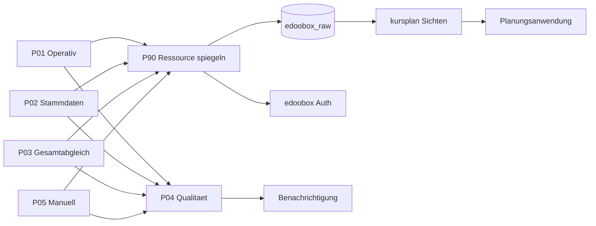

# Spezifikation produktive n8n-Workflows P90–P05

**Dokumenttyp:** Technische Spezifikation / „source of truth“ für die Implementierung
**Stand:** 6. September 2026
**Gegenstand:** Produktive n8n-Synchronisationskette P90 → P03 → P01 → P02 → P04 → P05 für die edoobox→PostgreSQL-Spiegelung
**Basis-Dokumente:** [`Übersicht der produktiven n8n-Workflows (1).md`](Übersicht der produktiven n8n-Workflows (1).md), [`Lastenheft Kursplan v1.6.md`](Lastenheft Kursplan v1.6.md), [`Vollständige Analyse der zwölf edoobox-Ressourcen (3).md`](Vollständige Analyse der zwölf edoobox-Ressourcen (3).md), [`edoobox_spiegelung_schema.sql`](edoobox_spiegelung_schema.sql), [`edoobox-Spiegelung  Sichten.sql`](edoobox-Spiegelung  Sichten.sql), [`edoobox-Spiegelung  Rechnungstabellen.sql`](edoobox-Spiegelung  Rechnungstabellen.sql), die Schritt-JSONs `edoobox Vollabgleich – Schritt N.json` sowie [`Postgres-Verbindungstest.json`](Postgres-Verbindungstest.json).

> **Abgrenzung:** Dieses Dokument spezifiziert ausschließlich. Es werden keine n8n-Workflows implementiert und keine bestehenden Dateien verändert. Widersprüche und Lücken der Quelldokumentation werden in [Kapitel 10](#10-offene-punkte-und-widersprueche) explizit ausgewiesen.

---

## 1. Zweck und Ziel

Die sechs produktiven Abläufe bilden die dauerhafte, nachvollziehbare Aktualisierung der edoobox-Spiegelung (Schema `edoobox_raw`) und der darauf aufbauenden Auswertungssichten (Schema `kursplan`). n8n ist alleiniger Schreiber der Rohdatentabellen; die Planungsanwendung liest ausschließlich über Sichten (E-28).

Grundprinzip der Zielarchitektur (statt Webhooks): **regelmäßiger vollständiger Listenabgleich** aller zwölf edoobox-Ressourcen mit **Hashvergleich**, damit unveränderte Datensätze nicht erneut geschrieben werden. Beim geprüften Bestand (37.459 Datensätze) sind 27 Listenaufrufe für einen Komplettlauf ausreichend.

---

## 2. Architekturüberblick

### 2.1 Workflow-Rollen

| Kennung | Rolle | Auslöser | Aufgabe |
|---|---|---|---|
| **P90** | Gemeinsamer Ressourcen-Unterworkflow | nur durch P01–P05 (Execute Sub-workflow) | Authentifizierung, Seitenabruf, Normalisierung, Hashvergleich, UPSERT, Lösch-Markierung, Laufprotokoll |
| **P03** | Wöchentlicher Gesamt- und Löschabgleich | Zeitgesteuert, wöchentlich nachts | alle zwölf Ressourcen vollständig prüfen, nicht mehr gelieferte Datensätze als gelöscht kennzeichnen |
| **P01** | Operative Ressourcen synchronisieren | Zeitgesteuert, alle 15 Min. werktags 08:00–23:45 | 7 operative Ressourcen abgleichen |
| **P02** | Stamm- und Referenzdaten synchronisieren | Zeitgesteuert, täglich nachts | 5 Stamm-/Referenzressourcen abgleichen |
| **P04** | Qualitätskontrolle und Benachrichtigung | nach P01–P03 sowie täglich | Beziehungen, Vollständigkeit, Laufalter, DB-I-Berechenbarkeit prüfen; Abweichungen melden |
| **P05** | Manueller Wiederanlauf | manuell | einzelne Ressource oder Komplettabgleich kontrolliert erneut ausführen |

### 2.2 Abhängigkeiten und Ausführungsreihenfolge

```
P03 (wöchentlich) ──► P04
P01 (15-Minuten) ──► P04
P02 (täglich)    ──► P04
P05 (manuell)    ──► P04

P01 ──► P90 (je Ressource, 7×)
P02 ──► P90 (je Ressource, 5×)
P03 ──► P90 (je Ressource, 12×)
P05 ──► P90 (je gewählter Ressource)
```

Reihenfolge-Empfehlung (aus dem Lastenheft, E-33): **P90 zuerst**, dann **P03** (Referenzlauf), danach **P01**, **P02**, **P04**, **P05**.

### 2.3 Datenfluss



---

## 3. Definition der einzelnen Workflows

### 3.1 P03 — Wöchentlicher Gesamt- und Löschabgleich

- **Zweck:** Verbindlicher Referenzlauf für den vollständigen Bestand; erkennt entfallene Datensätze.
- **Zeitplan:** einmal wöchentlich nachts (Vorschlag Sonntag 03:00 Uhr, Zeitzone `Europe/Berlin`). Während des Laufs starten P01 und P02 nicht.
- **Umfang:** alle zwölf Ressourcen.
- **Besonderheiten:**
  - je Ressource eine **eigene Laufkennung** in `sync_run`.
  - Vollständigkeitsnachweis: gemeldete = gelesene = gespeicherte Anzahl je Ressource.
  - nicht mehr gelieferte lokale Datensätze erhalten `is_deleted = true` (kein physisches Löschen).
  - Trainerzuordnung aus `dates.leader[]` wird vollständig neu aufgebaut; Mehrfachzuweisungen zulässig.
  - Nach Abschluss P04 ausführen.

### 3.2 P01 — Operative Ressourcen synchronisieren

- **Zweck:** Bewegungsdaten für Kursbelegung, Erlös, Trainerzuordnung und DB I aktuell halten.
- **Zeitplan:** `*/15 8-23 * * 1-5`, Zeitzone `Europe/Berlin`. Keine Läufe 00:00–08:00 und am Wochenende. Keine parallelen Ausführungen.
- **Ressourcen (7):** `edo_offers`, `edo_dates`, `edo_bookings`, `edo_pricecategories`, `edo_attendances`, `edo_invoices`, `edo_transactions`.
- **Ablauf:** Lauf anlegen (`laeuft`) → kurzlebigen Token beziehen → Ressourcen nacheinander über P90 → UPSERT → Beziehungen aktualisieren → Lauf mit Zählwerten und `erfolgreich` abschließen → P04 ausführen.
- **Fehlerregel:** Eine fehlerhafte Ressource führt zum Laufstatus `fehler`.

### 3.3 P02 — Stamm- und Referenzdaten synchronisieren

- **Zweck:** selten ändernde, aber für Beziehungen/Bezeichnungen benötigte Daten aktualisieren.
- **Zeitplan:** täglich nachts (Vorschlag 02:00 Uhr). Nicht gleichzeitig mit P03.
- **Ressourcen (5):** `edo_admins`, `Vat`, `Countries`, `edo_categories`, `edo_users`.
- **Datenschutz:** Bei Admin-/Benutzerressourcen nur benötigte Felder normalisiert übernehmen; Rohdaten nur im erforderlichen Umfang und mit beschränkten Rechten.

### 3.4 P04 — Qualitätskontrolle und Benachrichtigung

- **Zweck:** verändert keine edoobox-Nutzdaten; prüft Zustand der Spiegelung und meldet Abweichungen.
- **Prüfungen:** Laufalter (P01 ≤ 30 Min. im Betriebszeitfenster; P02 ≤ 26 h; P03 ≤ 8 Tage), Vollständigkeit aller zwölf Ressourcen, Beziehungen (`dates.offer`, `dates.leader[]`, Buchungs-/Preis-/Anwesenheits-/Rechnungs-/Transaktionsbeziehungen), produktiver Nettoerlös ab 2023, offene Trainerkosten, Angebote ohne Trainer, ausgeschlossene Nicht-Kurstermine, DB-I-Berechenbarkeit.
- **Referenzstand (Kontrollmarken):** produktive Angebote 2.586, berechenbare Angebote ab 2023 1.696, produktiver Nettoerlös 430.049,62 €, Trainerkosten 227.452,00 €, Plattformkosten 11.715,00 €, direkte Kosten 239.167,00 €, DB I 190.882,62 €, DB-I-Marge 44,39 %, offene Kostenkonfigurationen 0.

### 3.5 P05 — Manueller Wiederanlauf

- **Zweck:** kontrollierte Fehlerbehebung/Wartung; nicht zeitgesteuert.
- **Eingaben:** Ressource oder `alle`; Abgleichsart `normal` oder `voll`; optionaler Hinweis.
- **Schutzmaßnahmen:** nur Administratoren; feste Ressourcen-Auswahlliste (keine freien Tabellen-/SQL-Namen); Lauf wird protokolliert; kein paralleler Start bei laufendem Abgleich; nutzt normale `n8n_writer`-Verbindung (nicht die administrative).

---

## 4. Detaillierte Spezifikation P90 (gemeinsamer Ressourcen-Unterworkflow)

### 4.1 Zweck und Rolle

P90 ist ein **technischer Unterworkflow ohne eigenen Zeitplan**. Er kapselt die technische Logik, die sonst in P01–P05 mehrfach kopiert würde: Authentifizierung, Seitennavigation, Normalisierung, Hashvergleich, UPSERT, Lösch-Markierung und Laufprotokoll.

### 4.2 Eingaben (Execute Sub-workflow-Parameter)

P90 erhält beim Aufruf aus P01–P05 folgende Parameter:

| Parameter | Bedeutung | Beispiel |
|---|---|---|
| `Ressourcenkennung` | feste Kennung aus der Konfigurationstabelle | `edo_offers` |
| `API-Pfad` | edoobox-Endpunkt | `/offer/list` |
| `Zieltabelle` | Ziel im Schema `edoobox_raw` | `offer` |
| `Primärschlüssel` | PK-Spalte der Zieltabelle | `offer_id` |
| `Seitengröße` | `limit[reply]`-Wert | `2000` |
| `Laufkennung` | `run_id` des übergeordneten Laufs | numerisch |
| `Löschungen auswerten` | Vollabgleich-Modus (`true`/`false`) | `true` |

**Sicherheitsregel:** P90 verarbeitet ausschließlich Ressourcen aus einer **fest hinterlegten Konfiguration**. Dynamisch zusammengesetzte Tabellen-/SQL-Namen aus Benutzereingaben sind ausgeschlossen (E-31c, E-31j).

### 4.3 Ausgaben

P90 gibt je Lauf zurück (Grundlage für `sync_run` und P04):

- Anzahl API-Aufrufe
- Anzahl gelesener Datensätze
- Anzahl neuer Datensätze
- Anzahl geänderter Datensätze
- Anzahl als gelöscht markierter Datensätze

### 4.4 Verarbeitungslogik (Reihenfolge)

1. **Konfiguration auflösen:** Ressourcenkennung gegen die feste Konfigurationstabelle prüfen; unbekannte Kennung → Fehler.
2. **API seitenweise abrufen** bis zur gemeldeten Gesamtzahl (siehe 4.5).
3. **Antwortstruktur und Pflichtfelder prüfen.**
4. **Nutzdaten normalisieren** (Typkonvertierung, Kennungsobjekt→Text, Zeitstempel).
5. **Datenschutzrelevante Felder begrenzen** (kein Name/Anschrift/E-Mail/IP; Besitzer nur als `md5`-Streuwert).
6. **Datensatz-Hash bilden** (siehe 4.6).
7. **Nur neue oder geänderte Datensätze schreiben** (UPSERT).
8. **`last_seen_at`/`last_synced_at`/`last_changed_at` und Laufkennung aktualisieren.**
9. **Bei Vollabgleich** nicht gesehene Datensätze als gelöscht markieren (`is_deleted = true`).
10. **Zählwerte zurückgeben.**

### 4.5 Paginierung und Filtern

- **Verfahren:** `GET {basis}/{API-Pfad}` mit Query-Parametern `limit[start]` (Versatz) und `limit[reply]` (Seitengröße).
- **Geprüfter Höchstwert** der Seitengröße: **2000** (nachweislich wirksam für `booking/list`); die Schritt-Workflows nutzen teils 500 bzw. 2000.
- **Gesamtanzahl:** wird im Hüllenfeld `limit.total` gemeldet; der Abruf läuft bis `start >= total` oder bis eine leere/zu kurze Seite geliefert wird.
- **Vollständigkeitsnachweis:** `gemeldet_total` muss der Anzahl der tatsächlich gesammelten Einträge entsprechen; Abweichung → Fehlerstatus (E-31f).
- **Schutz gegen nicht angenommenen Versatz:** wiederholt sich die erste Kennung einer Folgeseite, wird abgebrochen (kein Endlosschleifen).
- **Antwortstruktur:** `body.data` kann ein Array oder ein Objekt sein (dann `Object.values(data)` bzw. `Object.entries`).
- **Filter:** für die produktive Fassung **kein** inkrementeller Änderungsfilter — es wird vollständig gelesen und der Hashvergleich übernimmt die Differenzierung.

### 4.6 Hash-Bildung, Idempotenz und Vollabgleich

- **Hash:** `md5(concat_ws('|', …normalisierte Nutzfelder…))` als `payload_hash`. Der Hash umfasst ausschließlich fachlich relevante Felder (nicht `last_synced_at`/`first_seen_at`).
- **Zeitstempel-Semantik:**
  - `first_seen_at`: Zeitpunkt des ersten Auftretens (unverändert bei Updates).
  - `last_synced_at`: wird bei jedem Lauf gesetzt.
  - `last_changed_at`: wird **nur** fortgeschrieben, wenn sich `payload_hash` geändert hat (E-27b).
- **UPSERT:** `INSERT … ON CONFLICT (pk) DO UPDATE SET …`, parametrisiert (keine String-Konkatenation, E-27d).
- **Lösch-Markierung (nur Vollabgleich):** lokale Datensätze, deren PK in der aktuellen Antwort fehlt, erhalten `is_deleted = true` (kein physisches Löschen, E-27c).
- **Idempotenz:** Wiederholung desselben Laufs erzeugt keine Dubletten; unveränderte Datensätze werden nicht als inhaltlich geändert protokolliert (AK-31).

### 4.7 Fehlerbehandlung

- HTTP-Status außerhalb 200–299 → Fehler mit Endpunkt und Statuscode.
- Pflichtfelder fehlen oder Antwortstruktur unerwartet → Fehler.
- `gemeldet_total ≠ gelesen` → Fehler.
- Jeder Fehler in P90 propagiert an den aufrufenden Workflow; der übergeordnete Lauf darf dann nicht als `erfolgreich` gelten (E-31d).
- Fehler werden in `sync_run.error_text` protokolliert und (über P04) gemeldet; erfolgreich verarbeitete andere Ressourcen bleiben nachvollziehbar.

### 4.8 Parallelitätsschutz

Gleichzeitig laufende Abgleiche **derselben Ressource** sind ausgeschlossen. Der übergeordnete Workflow bricht offene Läufe desselben Typs ab bzw. setzt sie auf `abgebrochen` (vgl. Muster in Schritt 3/11/16: `UPDATE sync_run SET status='abgebrochen' WHERE run_type=… AND status='laeuft'`), bevor ein neuer Lauf angelegt wird.

---

## 5. Ressourcen-Konfiguration und Zieltabellen

### 5.1 Feste Konfigurationstabelle (Soll für P90)

| Ressourcenkennung | Endpunkt | Zieltabelle (Schema `edoobox_raw`) | Primärschlüssel | Lösch-Auswertung |
|---|---|---|---|---|
| `edo_admins` | `/admin/list` | `trainer_admin` | `admin_id` | ja |
| `edo_dates` | `/date/list` | `offer_date` | `date_id` | ja |
| — (Zuordnung) | (aus `dates.leader[]`) | `date_leader` | `(date_id, admin_id)` | ja |
| `edo_offers` | `/offer/list` | `offer` | `offer_id` | ja |
| `edo_bookings` | `/booking/list` | `booking` | `booking_id` | ja |
| — (Positionen) | (aus `bookings.users[]`) | `booking_position` | `(booking_id, pricecategory_id)` | ja |
| — (Transaktionen) | (aus Buchung bzw. `/transaction/list`) | `booking_transaction` | `transaction_id` | ja |
| `edo_invoices` | `/invoice/list` | `invoice` | `invoice_id` | ja |
| — (Posten) | `/invoice/{id}/data` | `invoice_item` | `(invoice_id, item_key)` | ja |
| — (Zeilen) | `/invoice/{id}/data` | `invoice_line` | `(invoice_id, position)` | ja |
| — (Zahlungen) | `/invoice/{id}/data` | `invoice_payment` | `pay_id` | ja |
| — (Belege) | `/invoice/{id}/data` | `invoice_receipt` | `receipt_id` | ja |

### 5.2 Wichtiger Hinweis zur Kennungs-Diskrepanz

Die Zielarchitektur-Dokumente verwenden Ressourcenkennungen (`edo_offers`, `edo_dates`, `edo_bookings`, `edo_pricecategories`, `edo_attendances`, `edo_transactions`, `edo_admins`, `Vat`, `Countries`, `edo_categories`, `edo_users`). Die tatsächlich im Workspace vorhandenen Tabellen heißen jedoch anders (`offer`, `offer_date`, `booking`, `booking_position`, `booking_transaction`, `invoice*`, `trainer_admin`, `date_leader`). **Die Ressourcenkennungen sind fachliche Bezeichner, keine Tabellennamen.** P90 bildet die Zuordnung über die feste Konfigurationstabelle ab (siehe 5.1).

### 5.3 Lücke: fehlende Zieltabellen

Für folgende der zwölf Ressourcen ist im Workspace **keine** Zieltabelle definiert (Details in [Kapitel 10](#10-offene-punkte-und-widersprueche)):

- `Vat` (Umsatzsteuer, `/vat/list`)
- `Countries` (Länder, `/country/list`)
- `edo_categories` (Kategorien, `/category/list`)
- `edo_users` (Benutzer, `/user/list`) — nur `user_ref`-Hash in `booking`/`invoice`
- `edo_pricecategories` (Preiskategorien, `/pricecategory/list`) — nur als `booking_position` und `preiskategorie_ausnahme`
- `edo_attendances` (Anwesenheiten, `/attendance/list`)
- `edo_transactions` (Transaktionen, `/transaction/list`) — nur Buchungsbezug in `booking_transaction`; die eigenständige Gesamtressource ist umfangreicher

---

## 6. Feld-Mappings

### 6.1 `edo_offers` → `edoobox_raw.offer`

Quelle: Schritt 16/16a. Angebote enthalten keine Personenangaben, daher wird die vollständige Antwort zusätzlich als `payload` (jsonb) gesichert.

| Zielspalte | Typ | Quelle / Transformation |
|---|---|---|
| `offer_id` | text (PK) | `id` (Kennung als Text) |
| `offer_number` | text | `offer_number` |
| `name` | text | `name` |
| `category_ref` | text | `category` (Kennung) |
| `offerdef_ref` | text | `offerdef` (Kennung) |
| `place_ref` | text | `place` (Kennung) |
| `date_start` | timestamptz | `date_start` (zeitpunkt-Konvertierung, nur gültige Daten) |
| `date_end` | timestamptz | `date_end` |
| `date_signupstart` | timestamptz | `date_signupstart` |
| `date_close` | timestamptz | `date_close` |
| `user_minimal` | integer | `user_minimal` |
| `user_maximum` | integer | `user_maximum` |
| `status` | text | `status` |
| `mode` | text | `mode` |
| `offer_type` | text | `offer_type` |
| `vat_rate` | numeric(6,3) | `vat_rate` |
| `country` | text | `country` |
| `internal_code` | text | `internal_code` |
| `is_archived` | boolean | `is_archived` |
| `is_trash` | boolean | `is_trash` |
| `has_waiting_list` | boolean | `has_waiting_list` |
| `mustpay` | boolean | `mustpay` |
| `is_multi_offer` | boolean | `is_multi_offer` |
| `is_multi_offer_child` | boolean | `is_multi_offer_child` |
| `payload` | jsonb | vollständige Antwort |
| `first_seen_at` / `last_synced_at` / `last_changed_at` / `payload_hash` / `is_deleted` | — | Buchführungsfelder gemäß 4.6 |

**Hash-Felder (offer):** `name, offer_number, category_ref, place_ref, date_start, date_end, user_minimal, user_maximum, status, mode, offer_type, vat_rate, is_archived, is_trash`.

### 6.2 `edo_dates` → `edoobox_raw.offer_date` und `edoobox_raw.date_leader`

Quelle: Schritt 54/54a.

**`offer_date`:**

| Zielspalte | Typ | Quelle |
|---|---|---|
| `date_id` | text (PK) | `id` |
| `offer_id` | text | `offer` (Kennung) |
| `date_start` | timestamptz | Beginn |
| `date_end` | timestamptz | Ende |
| `place_ref` | text | Ort (Kennung) |
| `room_ref` | text | Raum (Kennung) |
| Buchführungsfelder | — | `first_seen_at`, `last_synced_at`, `is_deleted` |

**`date_leader`** (n:m, mehrere Trainer je Datumszeile zulässig):

| Zielspalte | Typ | Quelle |
|---|---|---|
| `date_id` | text (PK-Teil, FK → offer_date) | Datumszeile |
| `admin_id` | text (PK-Teil) | ein Eintrag aus `leader[]` |

**Datenschutz:** Aus `/admin/list` werden nur `id`, `shortcut`, `permission` und Aktiv-Status übernommen; keine Namen/Kontaktdaten.

### 6.3 `edo_bookings` → `edoobox_raw.booking`

Quelle: `edoobox_spiegelung_schema.sql` (Tabelle 1.1) und Schritt 11.

| Zielspalte | Typ | Quelle / Transformation |
|---|---|---|
| `booking_id` | text (PK) | `id` |
| `offer_id` | text | `offer` |
| `status` | text | `status` |
| `booking_time` | timestamptz | `time` |
| `is_b2b` | boolean | B2B-Kennzeichen |
| `is_multi_offer` | boolean | Mehrfachangebot-Kennzeichen |
| `user_ref` | text | `md5(owner)` — nicht umkehrbarer Streuwert |
| `source` | text | `'api'` (Check: api/webhook/manuell) |
| `first_seen_at` / `last_synced_at` / `last_changed_at` / `payload_hash` / `is_deleted` | — | Buchführungsfelder |

**Bewusst NICHT gespeichert:** Name, Rechnungsanschrift, IP-Adresse, E-Mail (E-27a).

**Hash-Felder (booking):** `offer, status, time, mustpay, label`.

### 6.4 Buchungspositionen → `edoobox_raw.booking_position`

Quelle: `edoobox_spiegelung_schema.sql` (Tabelle 1.2), Schritt 12 (Formung aus Buchungsdetails).

| Zielspalte | Typ | Quelle |
|---|---|---|
| `position_id` | bigint IDENTITY | generiert |
| `booking_id` | text (FK → booking) | Buchung |
| `pricecategory_id` | text | Preiskategorie-Kennung |
| `pricecategory_name` | text | Bezeichnung |
| `amount_net` | numeric(12,2) | Nettobetrag **je Platz** |
| `currency` | char(3) | `EUR` |
| `quantity` | integer | Anzahl Plätze |
| `is_default` | boolean | Kennzeichen |
| `last_synced_at` | timestamptz | — |

**Eindeutigkeit:** `UNIQUE (booking_id, pricecategory_id)`. Behebt Einschränkung 1 aus E-24a (alle Kategorien, nicht nur die erste).

### 6.5 Transaktionen → `edoobox_raw.booking_transaction`

Quelle: `edoobox_spiegelung_schema.sql` (Tabelle 1.3).

| Zielspalte | Typ | Quelle |
|---|---|---|
| `transaction_id` | text (PK) | `id` |
| `booking_id` | text (FK → booking) | Buchung |
| `transaction_number` | text | Vorgangsnummer |
| `amount` | numeric(12,2) | Betrag |
| `currency` | char(3) | `EUR` |
| `transaction_time` | timestamptz | Zeitpunkt |
| `last_synced_at` | timestamptz | — |

**Hinweis:** getrennt geführt, damit Teilzahlungen den Erlös nicht vervielfachen (E-24a Nr. 4). Die eigenständige Gesamtressource `/transaction/list` ist umfangreicher (1.099 Transaktionen ohne Buchungs-/Angebotsbezug) — siehe offene Punkte.

### 6.6 Rechnungen → `edoobox_raw.invoice*`

Quelle: [`edoobox-Spiegelung  Rechnungstabellen.sql`](edoobox-Spiegelung  Rechnungstabellen.sql), Schritt 26/26a. Quelle `/v2/invoice/list` und `/v2/invoice/{id}/data`.

**`invoice` (Kopf):** `invoice_id` (PK), `invoice_number`, `user_ref` (md5), `status` (1 offen / 2 bezahlt / 3 storniert), `status_text`, `currency`, `amount`, `amount_pay`, `line_total`, `tax_basis_total`, `tax_total`, `grand_total`, `due_payable`, `prepaid_total`, `allowance_total`, `charge_total`, `date_create`, `date_pay`, `date_payuntil`, `date_cancelled`, `offer_start_date`, `address_country`, `address_postcode`, `buyer_reference`, `language`, `payload` (jsonb), Buchführungsfelder (`first_seen_at`, `last_synced_at`, `last_changed_at`, `payload_hash`, `is_deleted`).

**`invoice_item` (Posten aus `items.contained`):** `invoice_id` + `item_key` (PK), `item_type` (`t_booking`/`t_manualtrans`), `transaction_id` (Brücke zur Buchung), `transaction_number`, `description`, `amount`, `vat_percent`, `vat_ref`, `promotion_name`, `promotion_amount`, `promotion_vat_percent`, `pricecategory_count`, `last_synced_at`.

**`invoice_line` (gedruckte Zeilen aus `invoice_data.items`):** `invoice_id` + `position` (PK), `quantity`, `price_net`, `price_net_summation`, `vat_type`, `vat_percent`, `transaction_number`, `details`, `last_synced_at`.

**`invoice_payment` (Zahlungen):** `pay_id` (PK), `invoice_id`, `amount`, `currency`, `status`, `date_pay`, `system`, `system_id`, `last_synced_at`.

**`invoice_receipt` (Belege/Gutschriften):** `receipt_id` (PK), `invoice_id`, `receipt_number`, `amount`, `currency`, `date_create`, `last_synced_at`.

**Auffälligkeit (dokumentiert):** `invoice.paytrans` ist **keine** Transaktions-ID (passt zu keiner `transactions.id`) und darf nicht mit der Transaktionstabelle verknüpft werden. Die harte Brücke liegt in `invoice_item.transaction_id`.

### 6.7 Trainerzuordnung → `edoobox_raw.trainer_admin` + `edoobox_raw.date_leader`

Siehe 6.2. Aus `/admin/list` werden ausschließlich `id`, `shortcut`, `permission`, Aktiv-Status übernommen (`admin_id`, `shortcut`, `permission`, `is_active`).

### 6.8 Nicht benötigte Ressourcen/Felder (Zweckbindung)

Laut [`Vollständige Analyse der zwölf edoobox-Ressourcen (3).md`](Vollständige Analyse der zwölf edoobox-Ressourcen (3).md) sind **nicht erforderlich für DB I** und daher datenschutz-/zweckbedingt nicht zu spiegeln: vollständige Teilnehmerdaten aus `edo_users`, `edo_attendances`, eingebettete Personendaten aus `transactions.userdata`, Zahlungsdaten ohne Buchungs-/Angebotsbezug.

---

## 7. n8n-Umsetzungsdetails für P90

### 7.1 Workflow-Aufbau (Node-Kette)

Als Unterworkflow wird P90 über einen **Execute Workflow Trigger** aufgerufen und läuft mit dem Muster „Token → Holen → Speichern“ aus den Schritt-Workflows:

```
[Execute Workflow Trigger / Eingang]
        │
        ▼
[P90 Konfiguration aufloesen]   (Code — feste Konfigurationstabelle, Ressourcenkennung prüfen)
        │
        ▼
[P90 Token holen]               (HTTP Request, executeOnce=true, /v2/auth)
        │
        ▼
[P90 <Ressource> holen]         (Code — seitenweiser Abruf + Normalisierung + Hash)
        │
        ▼
[P90 <Ressource> speichern]     (Postgres — UPSERT + Lösch-Markierung)
        │
        ▼
[P90 Zählwerte ausgeben]        (Code/Postgres — Anzahl API-Aufrufe, gelesen/neu/geändert/gelöscht)
        │
        ▼
[P90 Lauf abschließen]          (Postgres — sync_run fertig melden; optional im Aufrufer)
```

**Fehlerpfad:** separater Error-Trigger (`n8n-nodes-base.errorTrigger`) im Unterworkflow bzw. Error-Workflow des Aufrufers, der `sync_run.error_text` setzt und den Lauf auf `fehler` stellt.

### 7.2 Node-Typen und Versionen (aus den vorhandenen Exporten)

| Zweck | Node-Typ | typeVersion | Bemerkung |
|---|---|---|---|
| Manueller/Zeit-Trigger | `n8n-nodes-base.manualTrigger` / `scheduleTrigger` | 1 | für P01–P03 als Schedule Trigger mit Cron |
| Unterworkflow-Eingang | `n8n-nodes-base.executeWorkflowTrigger` | 1 | Eingang von P90 |
| Unterworkflow-Aufruf | `n8n-nodes-base.executeWorkflow` | 1 | in P01–P05 |
| Token-Abruf | `n8n-nodes-base.httpRequest` | 4.2 | `method=POST`, `authentication=genericCredentialType`, `genericAuthType=httpCustomAuth`, `executeOnce=true` |
| Seitenabruf/Normalisierung | `n8n-nodes-base.code` | 2 | seitenweiser Abruf über `this.helpers.httpRequest` |
| UPSERT/Lösch-Markierung | `n8n-nodes-base.postgres` | 2.6 | `operation=executeQuery` |
| Fehlerbehandlung | `n8n-nodes-base.errorTrigger` | 1 | Error Workflow |

### 7.3 Authentifizierung

- **Token-Abruf:** `POST {basis}/v2/auth`, Header `grant-type: password`, `Content-Type: application/json`, Body `expire` (`{{ $now.plus({ hours: 2 }).toISO() }}` bzw. 24 h). Authentifizierung über `genericCredentialType`/`httpCustomAuth` (Schlüssel + Geheimnis in der **n8n-Anmeldedatenverwaltung**, nie im Export — E-32a).
- **Token-Antwortformen** (beide unterstützen): (A) Token in `data`, `edid` oberste Ebene (app1); (B) Token in `access_token`, `edid` in `data.edid` (Doku V2). P90 muss beide Formen abfangen: `const token = typeof auth.data === 'string' ? auth.data : auth.access_token; const edid = auth.edid ?? auth?.data?.edid;`.
- **Listen-Aufruf-Header:** `edid`, `grant-type: access_token`, `Authorization: Bearer ${token}`, `Content-Type: application/json`.
- **Basis-URL:** Schritt-Exporte nutzen `https://app1.edoobox.com/v2` (ein Export `https://app2.edoobox.com/v2/auth`). Offener Punkt in [Kapitel 10](#10-offene-punkte-und-widersprueche).

### 7.4 Credentials

| Credential | Typ | Verwendung |
|---|---|---|
| edoobox API (Schlüssel + Geheimnis) | `httpCustomAuth` / `genericCredentialType` | Token-Abruf in P90 |
| PostgreSQL `n8n_writer` | `postgres` | alle Schreibvorgänge in `edoobox_raw` |

- `n8n_writer` hat `SELECT, INSERT, UPDATE` auf alle Tabellen in `edoobox_raw` sowie `USAGE` auf Sequenzen (E-28b).
- Die **administrative** PostgreSQL-Verbindung (`kursplan_user`) wird **nicht** in den produktiven Synchronisations-Workflows verwendet; sie bleibt den einmaligen Verwaltungswerkzeugen (Tabellen-/Sichtenanlage) vorbehalten.
- In den vorhandenen JSON-Exporten sind keinerlei Credentials eingebettet (konsistent mit DS-12/E-32a).

### 7.5 Namenskonventionen

- **Deutsch**, sprechend, mit Ressourcen-/Workflow-Präfix.
- Muster für P90-Nodes: `P90 Konfiguration aufloesen`, `P90 Token holen`, `P90 <Ressource> holen`, `P90 <Ressource> speichern`, `P90 Zaehlwerte ausgeben`, `P90 Lauf abschliessen`.
- Muster für Aufrufer (P01–P05): `<Kennung> Lauf anlegen`, `<Kennung> Token holen`, `<Kennung> <Ressource> spiegeln` (Execute Workflow), `<Kennung> Lauf abschliessen`.
- Referenz aus Bestand: `S16 Lauf anlegen`, `S16 Token holen`, `S16 Angebote holen`, `S16 Angebote speichern` (Schritt 16), `Datenbank pruefen` (Schritt 1), `Postgres-Verbindung testen` (Postgres-Verbindungstest).

### 7.6 Transaktionale Schreibmuster

Das UPSERT-Muster aus Schritt 16/11/54 ist als Vorlage verbindlich:

- Eingangsdaten als JSON über `jsonb_to_recordset($edoJson$…$edoJson$::jsonb)`.
- `kennzahlen`-CTE berechnet `zeilen` und `geaendert` (Vergleich `payload_hash IS DISTINCT FROM`).
- `geschrieben`-CTE führt den `INSERT … ON CONFLICT (pk) DO UPDATE` aus und aktualisiert `last_changed_at` nur bei Hash-Änderung.
- `fehlend`-CTE setzt `is_deleted = true` für PKs, die in der Antwort fehlen (nur im Vollabgleich-Modus).
- Optional `BEGIN; … COMMIT;` um mehrere CTEs transaktional zu klammern.

---

## 8. Hinweise für die Folge-Workflows

### 8.1 P03 (Referenzlauf)

- Lädt alle zwölf Ressourcen über P90 mit `Löschungen auswerten = true`.
- Je Ressource eigene `run_id`; Zählwerte je Ressource in `sync_run` dokumentieren.
- Vollständigkeitsnachweis je Ressource (gemeldet = gelesen = gespeichert).
- Trainerzuordnung (`date_leader`) vollständig neu aufbauen.

### 8.2 P01 (operativ)

- Cron `*/15 8-23 * * 1-5`, Zeitzone `Europe/Berlin`; Parallelitätsschutz.
- `Löschungen auswerten = false` (kein Löschabgleich im 15-Minuten-Takt).
- Beziehungsaktualisierung (Datumszeile→Angebot, Trainerzuordnung) nach dem Ressourcenabgleich.

### 8.3 P02 (Stammdaten)

- Cron täglich 02:00; Sperre gegen gleichzeitigen P03-Lauf.
- Fokus auf Datensparsamkeit bei Admin-/Benutzerdaten.

### 8.4 P04 (Qualitätskontrolle)

- Nach P01–P03 aufrufen (Execute Workflow) und zusätzlich täglich.
- Liest nur; schreibt nichts in `edoobox_raw`.
- Deckt Laufalter, Vollständigkeit, Beziehungen, offene Kosten und DB-I-Berechenbarkeit ab.

### 8.5 P05 (manuell)

- Manueller Trigger; Eingaben: Ressource/`alle`, Abgleichsart `normal`/`voll`, optionaler Hinweis.
- Feste Auswahlliste, keine freien SQL/Tabellennamen; nutzt `n8n_writer`.

---

## 9. Reihenfolge der Umsetzung (Empfehlung)

1. P90 als wiederverwendbarer Unterworkflow (inkl. fester Ressourcen-Konfiguration).
2. P03 als vollständiger Referenzlauf; gegen die Schritt-Prüfungen (S51/S52) verifizieren.
3. P01 aus P03 ableiten und werktags im 15-Minuten-Takt aktivieren.
4. P02 für die fünf Stammressourcen aktivieren.
5. P04 mit Protokoll- und DB-I-Kontrollen ergänzen.
6. Fehlerbenachrichtigung testen.
7. P05 für manuelle Wiederanläufe bereitstellen.
8. Alte Prüfworkflows (S01–S62) archivieren und deaktiviert lassen.

---

## 10. Offene Punkte und Widersprüche

Die folgenden Punkte sind vor bzw. während der Implementierung zu klären. Sie dürfen **nicht** stillschweigend durch Annahmen ersetzt werden.

### O-1 — Kennungs- vs. Tabellennamen

Die Zielarchitektur-Dokumente verwenden Ressourcenkennungen (`edo_offers`, `edo_dates`, `edo_bookings`, `edo_pricecategories`, `edo_attendances`, `edo_transactions`, `edo_admins`, `Vat`, `Countries`, `edo_categories`, `edo_users`), die **nicht** den tatsächlichen Tabellennamen (`offer`, `offer_date`, `booking`, `booking_position`, `booking_transaction`, `invoice*`, `trainer_admin`, `date_leader`) entsprechen. Es ist festzulegen, ob die Kennungen rein fachliche Bezeichner sind (Abbildung über die P90-Konfiguration) oder ob Tabellen umbenannt werden.

### O-2 — Fehlende Zieltabellen für 7 Ressourcen

Für `Vat`, `Countries`, `edo_categories`, `edo_users`, `edo_pricecategories`, `edo_attendances` und die vollständige `edo_transactions`-Ressource sind im Workspace **keine** Zieltabellen (CREATE TABLE) vorhanden. Es ist zu klären:

- welche dieser Ressourcen tatsächlich gespiegelt werden (Widerspruch zwischen „alle zwölf Ressourcen spiegeln“ in E-27/E-31 und „nicht erforderlich für DB I“ in der Ressourcenanalyse für `edo_users`, `edo_attendances`, Teile von `edo_transactions`).
- ob Zieltabellen neu angelegt werden müssen und mit welchen Feldern.

### O-3 — `sync_run`-Schema passt nicht zu P03/E-31g

Die vorhandene [`edoobox_raw.sync_run`](edoobox_spiegelung_schema.sql:120) ist **buchungszentriert** (`bookings_seen`, `bookings_changed`, `api_calls`) und hat `run_type`-Check auf `('inkrementell','vollabgleich','webhook','einzelabruf')`. E-31g und P03 verlangen je Lauf: Art, Beginn, Ende, Ergebnis, **Ressource**, gemeldete/gelesene Anzahl, neue/geänderte/gelöschte Anzahl und API-Aufrufe. Die Tabelle benötigt eine Erweiterung (z. B. Ressourcen-Spalte und Zählfelder) oder eine ergänzende Detailtabelle.

### O-4 — edoobox-Basis-URL und Server

Die Schritt-Exporte mischen `https://app1.edoobox.com/v2` und `https://app2.edoobox.com/v2/auth`; das Lastenheft verweist auf `https://v2.docs.edoobox.com`. Es ist verbindlich festzulegen, welche Basis-URL produktiv verwendet wird und ob app1/app2 mandantenabhängig ist.

### O-5 — Token-Gültigkeit

Die Exporte verwenden `expire` mit 2 h und 24 h. Für P03 (12 Ressourcen) und P01 ist die minimale, zum Lauf passende Gültigkeit verbindlich festzulegen (E-32).

### O-6 — Zeitplan-Details

Das Lastenheft nennt Vorschläge („beispielsweise 02:00/03:00 Uhr“), offene Frage 4 fragt explizit nach Wochentag/Uhrzeit für P03. Diese Werte sind zu bestätigen.

### O-7 — Benachrichtigungskanal für P04

Offene Frage 3 des Lastenhefts: Über welchen Kanal (E-Mail-System/-Konto) versendet P04 Qualitäts- und Fehlermeldungen.

### O-8 — Detailabruf Rechnungen und Buchungsdetails

Die Rechnungstabellen stammen aus `/v2/invoice/{id}/data` (Detailabruf). E-24 verbietet im Regelbetrieb Einzelabrufe sämtlicher Buchungsdetails. Es ist zu klären, wie die `booking_position`/`booking_transaction`-Daten produktiv **ohne** Detailendpunkt aus den Listenressourcen gewonnen werden (die Analyse verweist auf `booking/list` mit Teilnehmer-/Kategorie-/Transaktionsbezügen), und ob der Rechnungs-Detailabruf weiterhin zulässig ist.

### O-9 — Vollständige Transaktionsressource

1.099 von 5.137 Transaktionen haben keinen Buchungs-/Angebotsbezug. Es ist festzulegen, ob und in welche Tabelle diese übernommen werden (aktuell erfasst `booking_transaction` nur Buchungsbezug).

### O-10 — Historische Referenzlücken / Platzhalterprofile

Fehlende Admin-Kennungen (historische Trainer), gelöschte Angebote/Kategorien/Preiskategorien/Benutzer dürfen nicht durch erfundene aktuelle Datensätze ersetzt werden. Es ist zu klären, wie historische Platzhalterprofile (z. B. für nicht mehr ausgelieferte Trainerkennungen) technisch angelegt werden und ob die FK-Lücken dauerhaft toleriert werden.

---

## 11. Quellenverzeichnis

- [`Übersicht der produktiven n8n-Workflows (1).md`](Übersicht der produktiven n8n-Workflows (1).md) — Zielarchitektur P01–P05/P90
- [`Lastenheft Kursplan v1.6.md`](Lastenheft Kursplan v1.6.md) — Anforderungen E-27 bis E-34, E-24a, Abnahmefälle AK-29 bis AK-40
- [`Vollständige Analyse der zwölf edoobox-Ressourcen (3).md`](Vollständige Analyse der zwölf edoobox-Ressourcen (3).md) — Ressourcen, Beziehungen, Auffälligkeiten
- [`edoobox_spiegelung_schema.sql`](edoobox_spiegelung_schema.sql) — `booking`, `booking_position`, `booking_transaction`, `webhook_event`, `sync_run`, Preiskategorie-Regelwerk, Sichten
- [`edoobox-Spiegelung  Sichten.sql`](edoobox-Spiegelung  Sichten.sql) — Zuordnungs-/Steuer-/Erlössichten
- [`edoobox-Spiegelung  Rechnungstabellen.sql`](edoobox-Spiegelung  Rechnungstabellen.sql) — `invoice`, `invoice_item`, `invoice_line`, `invoice_payment`, `invoice_receipt`
- `edoobox Vollabgleich – Schritt 3/11/16/16a/54/54a.json` — Auth, Paginierung, Hash/UPSERT, Tabellen-DDL, Trainerzuordnung
- [`Postgres-Verbindungstest.json`](Postgres-Verbindungstest.json) — PostgreSQL-Node-Muster
